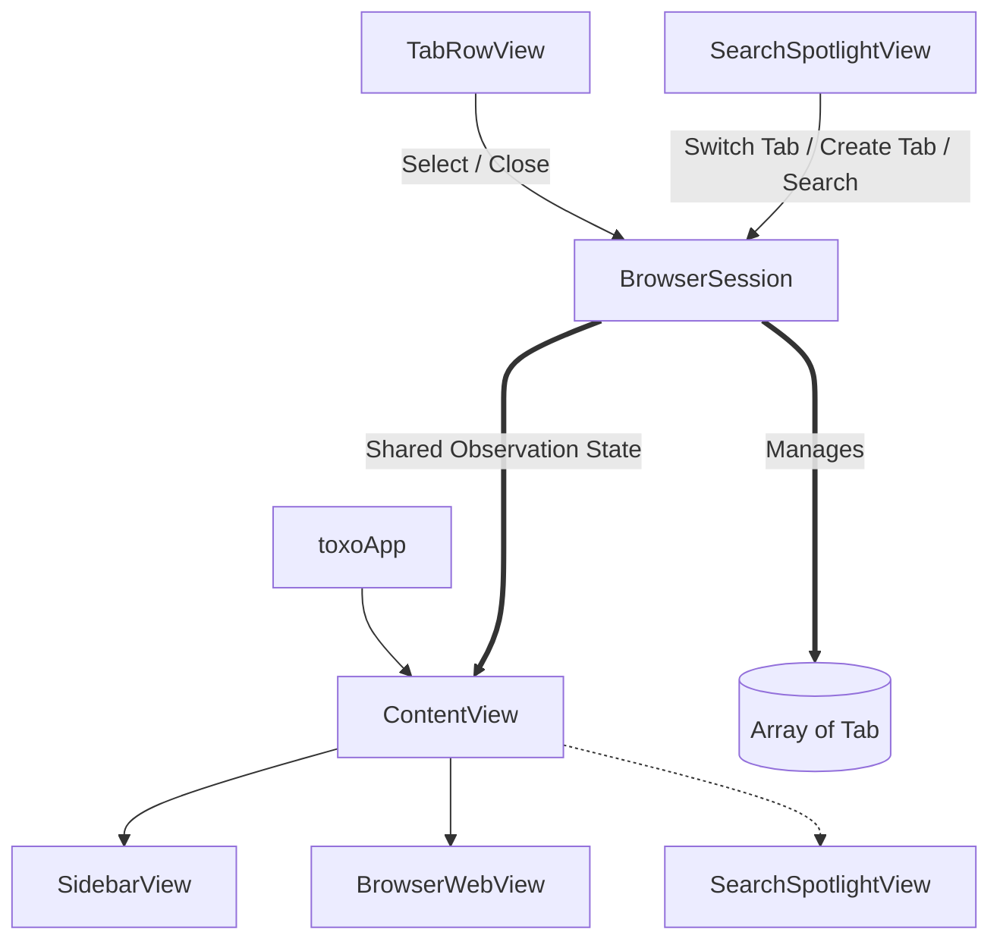

# toxo Browser Codebase Context

Welcome to the **toxo** codebase context documentation. This document explains the architecture, directory structure, key components, design tokens, and tools utilized in this sidebar-first macOS web browser.

---

## 1. Project Overview & Concept

**toxo** is a modern, lightweight, sidebar-first web browser designed specifically for macOS. Unlike traditional web browsers that display tabs in a horizontal strip along the top, **toxo** focuses on vertical space efficiency and multitasking by housing all tabs, navigation actions, and system settings in a resizable vertical sidebar.

### Core Features:
- **Sidebar-First Design**: A permanent, resizable vertical sidebar built on macOS's translucent material (`NSVisualEffectView`).
- **Persistent Tab States**: Each tab holds its own dedicated `WKWebView` instance, preserving scroll positions, login sessions, and page history when switching between tabs.
- **Spotlight Search**: A floating modal interface (similar to macOS Spotlight or Alfred) triggered for launching new tabs, switching tabs, or navigating URLs.
- **System Integration**: A customized window layout with hidden title bars, extending content under traffic light buttons, and supporting double-click title bar zooming.
- **Favicon Auto-fetching**: Dynamic retrieval of website favicons using the `FaviconFinder` package.

---

## 2. Project Path Structure

Below is the directory hierarchy and structure of the **toxo** codebase:

```text
toxo/
├── toxo.xcodeproj              # Xcode project configuration
├── context.md                  # This codebase documentation file [NEW]
├── skills-lock.json            # Agent skills configurations
├── toxo/                       # Core Source Files
│   ├── toxoApp.swift           # Application entry point & AppKit window customization
│   ├── toxo.entitlements       # App capability entitlements (sandbox/network permissions)
│   ├── ContentView.swift       # Top-level view coordinating Sidebar, main viewport & Spotlight overlay
│   │
│   ├── Models/                 # Domain logic and state management
│   │   ├── BrowserSession.swift# Active session state manager (holds active tabs, selection, spotlight state)
│   │   └── Tab.swift           # Represents a single tab; owns its WKWebView and favicon downloader
│   │
│   ├── Views/                  # Main UI Layouts
│   │   ├── Browser/
│   │   │   └── BrowserWebView.swift  # Page container hosting WKWebView or Dashboard/New Tab view
│   │   │
│   │   ├── Sidebar/
│   │   │   ├── SidebarView.swift     # Main panel container (Action buttons, search bar, pins, and tab list)
│   │   │   ├── TabRowView.swift      # Dynamic tab list item with hover transitions & close controls
│   │   │   └── NewTabRowView.swift   # Simplified action row to open Spotlight overlay for a new tab
│   │   │
│   │   ├── SearchSpotlightView.swift # Overlay for searching, autocomplete, switching tabs, or URL input
│   │   └── SettingsView.swift        # App preference pane (theme switcher: system/light/dark)
│   │
│   ├── Components/             # Reusable UI controls
│   │   ├── ActionButton.swift  # Bordered, hover-sensitive buttons for navigation (Back/Forward/Reload)
│   │   ├── CustomSearchBar.swift# Visual search bar showing path component coloring (domain vs. path)
│   │   └── ResizeHandleView.swift# AppKit-backed custom resize handle for sidebar dragging
│   │
│   ├── Utilities/              # Layout helpers & framework bridges
│   │   ├── Theme.swift         # Design tokens (spacings, corner radii) and custom ViewModifiers
│   │   ├── URLHelper.swift     # Sanitizer that converts queries into Google searches or valid URLs
│   │   └── WebViewContainer.swift# NSViewRepresentable wrapping WKWebView and setting up KVO observers
│   │
│   └── Assets.xcassets/        # App assets, icons, and color palettes
│       ├── AppIcon.appiconset
│       └── colors/             # Customized semantic color tokens:
│           ├── Foreground.colorset # Sidebar component container background
│           ├── background.colorset # Main window content pane background
│           ├── border.colorset     # Thin borders separating panels
│           ├── content.colorset    # Secondary text/icon color
│           └── main-content.colorset # Active primary text/icon color
│
├── toxoTests/                  # Unit test suite
└── toxoUITests/                # UI automation test suite
```

---

## 3. Architecture & Data Flow



### 1. State Management (Swift Observation)
The codebase leverages modern Swift Concurrency and state tracking using the `@Observable` macro:
- **`BrowserSession`** acts as the central coordinator. It is marked as `@MainActor` to ensure UI-thread safety. It coordinates the open tabs (`[Tab]`), currently selected tab ID, spotlight search display status, and controls loading URLs.
- **`Tab`** represents an individual tab. Each tab maintains its own unique identifier (`UUID`), page title, loading status, navigation flags (can go back/forward), progress, favicon, and crucially, its own **persistent `WKWebView` instance**. This guarantees page state persistence when switching views.

### 2. WKWebView & SwiftUI Integration
SwiftUI does not provide a native Web view, so `WKWebView` is wrapped in an `NSViewRepresentable` called **`WebViewContainer`**.
- **KVO (Key-Value Observation)** is established on the `WKWebView` properties (`isLoading`, `title`, `url`, `estimatedProgress`, `canGoBack`, `canGoForward`) to mirror these updates back to the parent `@Observable Tab` instance.
- A **`Coordinator`** serves as the `WKNavigationDelegate` to intercept navigation events, toggle loading states, and initiate favicon retrieval upon successful page load.

### 3. Window Customization & Title Bar
The app achieves its sleek, borderless layout by customizing the macOS window style:
- The app delegate (`AppDelegate`) intercepts window creation, inserts the `.fullSizeContentView` style mask, and hides the title visibility and toolbar. This lets the content render directly under the window's traffic light control buttons.
- A custom `TitleBarDoubleClickView` spans the top of the interface. This invisible `NSView` intercepts double-clicks to match the native macOS double-click-to-zoom/maximize preferences.
- A custom translucent backdrop (`VisualEffectView`) wraps `NSVisualEffectView` behind the window, providing the signature native sidebar material.

---

## 4. Key Components Breakdown

### Models
- **[Tab.swift](file:///Users/assimgenshi/Documents/2.coding%20project/toxo/toxo/Models/Tab.swift)**: Holds metadata for a tab. When loaded, it utilizes the `FaviconFinder` package to download the host site's favicon in a background task and parses it into an `NSImage`.
- **[BrowserSession.swift](file:///Users/assimgenshi/Documents/2.coding%20project/toxo/toxo/Models/BrowserSession.swift)**: Manages tab arrays, provides tab switching/creation operations, handles URL loading, and coordinates spotlight states.

### Core Views
- **[ContentView.swift](file:///Users/assimgenshi/Documents/2.coding%20project/toxo/toxo/ContentView.swift)**: Arranges the layout using an `HStack`. The left-hand sidebar is bounded by the `activeSidebarWidth`, and a draggable overlay sits between the sidebar and the main content pane.
- **[SidebarView.swift](file:///Users/assimgenshi/Documents/2.coding%20project/toxo/toxo/Views/Sidebar/SidebarView.swift)**: Contains navigation shortcuts, a read-only search bar that opens Spotlight, a pin tab placeholder, a scrollable list of tabs, and a settings footer.
- **[BrowserWebView.swift](file:///Users/assimgenshi/Documents/2.coding%20project/toxo/toxo/Views/Browser/BrowserWebView.swift)**: Displays the web view if a URL is active. Otherwise, it presents a dynamic dashboard (`NewTabDashboardView`) containing search inputs and visual quick-link shortcut cards.
- **[SearchSpotlightView.swift](file:///Users/assimgenshi/Documents/2.coding%20project/toxo/toxo/Views/SearchSpotlightView.swift)**: A keyboard-navigable overlay that filters open tabs and suggests search terms based on input. Handles native key events (`upArrow`/`downArrow`/`enter`/`escape`) using `onKeyPress` and `onExitCommand`.

### Reusable Components & Utilities
- **[ResizeHandleView.swift](file:///Users/assimgenshi/Documents/2.coding%20project/toxo/toxo/Components/ResizeHandleView.swift)**: A custom drag controller. Captures mouse events directly in AppKit to prevent stuttering issues common to SwiftUI gestures on macOS during window-level resizing.
- **[CustomSearchBar.swift](file:///Users/assimgenshi/Documents/2.coding%20project/toxo/toxo/Components/CustomSearchBar.swift)**: Takes a URL string and outputs an `AttributedString` where the main domain is highlighted in primary text color (`main-content`), and the remaining path is muted in secondary text color (`content`).
- **[URLHelper.swift](file:///Users/assimgenshi/Documents/2.coding%20project/toxo/toxo/Utilities/URLHelper.swift)**: Detects whether input is a valid website URL or search terms. Pre-pends `https://` if necessary, or formats a search string for Google.

---

## 5. Design System & Aesthetics

**toxo** follows strict visual design rules that emphasize a premium native macOS feeling:

- **Materials & Translucency**: The sidebar features an `NSVisualEffectView` with a `.sidebar` material blending behind the window, giving it a translucent glassmorphism look.
- **Theme-Based Colors**: Custom colors in `Assets.xcassets/colors` support light and dark modes:
  - `background`: Used for the main browser content area.
  - `Foreground`: Card-like backgrounds container for grouping sidebar items.
  - `border`: Separators and strokes.
  - `content`: Subtitles and disabled icons.
  - `main-content`: Active, high-contrast labels and icons.
- **Border Radii (Theme.CornerRadius)**:
  - `component = 10`: Standard interactive items (e.g., buttons, tabs, input bars).
  - `container = 12`: Wrapping section outlines.
  - `small = 6`: Tiny icons (e.g., close buttons).

---

## 6. External Tools & Dependencies

- **Swift Package Manager (SPM)**: Used for managing external dependencies.
- **FaviconFinder**: An external Swift package used to fetch website favicons dynamically.
  - *Integration*: Initialized as `FaviconFinder(url: url).fetchFaviconURLs().download().largest()`.
- **WebKit (WKWebView)**: The rendering engine powering page display. Custom cookies, user agents, and javascript environments can be set up in `Tab.swift` by modifying the `WKWebViewConfiguration`.
